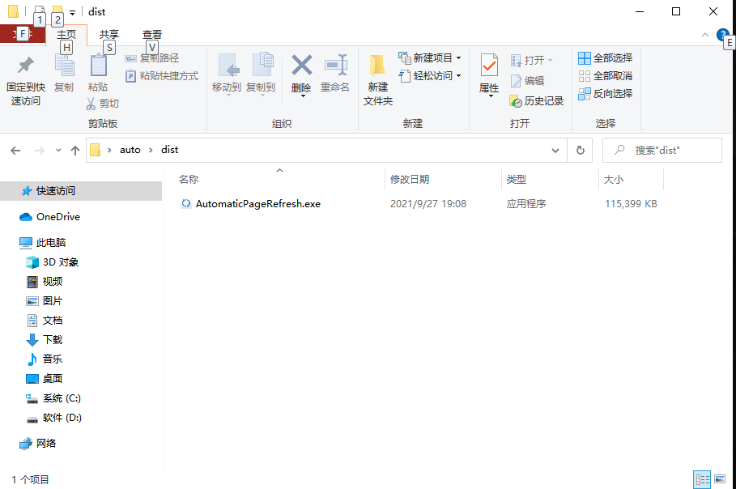
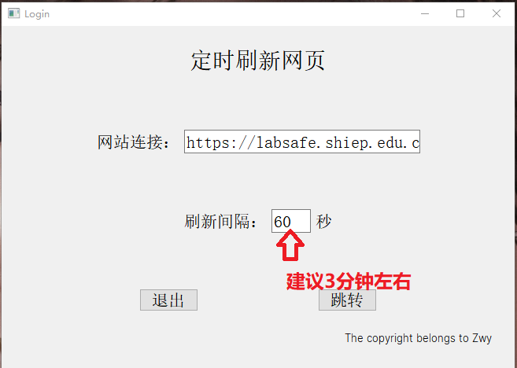

#自动刷新网页

## 一：打开软件

双击即可，有点慢

## 二、设置网址和间隔时间

间隔时间建议3分钟以上

## 	三、最重要的事

需要登录的网页，一定要登录，不然数据库没办法记录时长，就白刷了，白刷了，白刷了！！！

需要登录的网页，一定要登录，不然数据库没办法记录时长，就白刷了，白刷了，白刷了！！！

需要登录的网页，一定要登录，不然数据库没办法记录时长，就白刷了，白刷了，白刷了！！！

### 开发不易，如果对你有用，可酌情投喂！！！！！！

